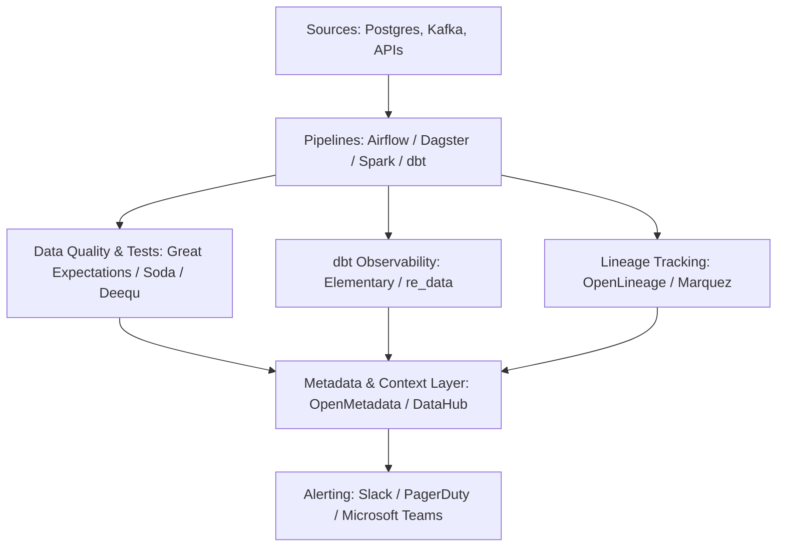

# Awesome Data Observability 🔍 📊

  

  
  
  
  
  
  

---

## 🌟 Top Data Observability Platforms & Ecosystem

> **A curated, battle-tested list of SaaS platforms, open-source testing frameworks, dbt-native monitoring libraries, and data reliability engines.**
> 
> *Targeting Data Quality Monitoring, Anomaly Detection, Freshness & Volume Checks, Schema Drift, End-to-End Lineage, Incident Management & Data Pipeline Reliability for Modern Data Platforms and AI Systems.*

**Last updated: August 2026** ⚡

---

### 📖 Overview

**Data Observability** is the degree of visibility an organization has into the health and reliability of its data estate. Analogous to APM (Application Performance Monitoring) and DevOps telemetry, data observability continuously tracks **5 Key Pillars**:

1. ⏱️ **Freshness**: Is the data up-to-date and arriving within defined SLAs?
2. 📦 **Volume**: Are data volumes expected, or did upstream ingest drop/duplicate rows?
3. 🧬 **Schema**: Have column types changed, been deleted, or introduced silent downstream drift?
4. 📈 **Distribution & Quality**: Are statistical values within acceptable ranges (e.g., null ratios, distinct counts, z-score anomalies)?
5. 🗺️ **Lineage & Impact**: Where did the data originate, which transformation models did it traverse, and which BI dashboards / ML applications depend on it?

---

## 📑 Table of Contents

- [☁️ SaaS/Hosted Platforms](#️-saashosted-platforms)
- [🐙 Open-Source GitHub Projects](#-open-source-github-projects)
- [🛠️ Architectural Blueprints & Stacks](#️-architectural-blueprints--stacks)
- [🤝 How to Contribute](#-how-to-contribute)
- [⚖️ Disclaimer](#️-disclaimer)
- [⭐ Star History](#-star-history)

---

## ☁️ SaaS/Hosted Platforms

*Sorted by Company Scale / Valuation / Revenue (Descending)* 📊

| Platform | Description | Company Scale (Valuation / Revenue / Parent) | Pricing | Free Tier Limits |
| :--- | :--- | :--- | :--- | :--- |
| **[Databand (IBM watsonx.data)](https://www.ibm.com/)** | Enterprise data pipeline observability and reliability platform (acquired & powered by IBM) for monitoring ETL/ELT workflows. | **IBM subsidiary** (~$180B+ Public Market Cap / ~$62B+ Annual Revenue) | IBM Resource Unit quote-based / watsonx subscription (starts at ~$1,000+/mo) | 30-day free trial of IBM watsonx.data with data observability components |
| **[Metaplane](https://www.metaplane.dev/)** | User-friendly data observability platform known for rapid setup, automated monitors, and warehouse-centric teams (acquired by Datadog). | **Datadog subsidiary** (~$40B+ Public Market Cap; Datadog acquired in 2025) | Free tier available; Pro plan starts at ~$10/monitored table/mo (or custom tier) | Free forever plan: Up to 10 monitored tables, up to 4 users, schema change alerts, column-level lineage |
| **[Monte Carlo](https://www.montecarlodata.com/)** | Pioneer enterprise data observability platform offering end-to-end automated monitoring across freshness, volume, schema, distribution, and lineage. | **$1.6B Valuation** ($236M Raised, ~$81M+ ARR) | Enterprise quote-based (starts at ~$25,000/year for small deployments of 30–100 tables) | No free tier; 14 to 30-day guided POC available on request (scoped to specific tables/sources) |
| **[Observe Inc.](https://www.observeinc.com/)** | Unified observability and data pipeline telemetry platform built natively on Snowflake for logs, metrics, traces, and dataset monitoring. | **~$848M Valuation** ($393M Raised, $156M Series C) | Ingestion-based: Logs from $0.49/GiB, Traces from $0.59/GiB, Metrics from $0.008/M data points | 14-day free trial: Full platform access with high-ceiling compute credits, no credit card required |
| **[Acceldata](https://www.acceldata.io/)** | Comprehensive enterprise data observability covering data quality, pipeline reliability, and compute/cost performance across hybrid/multi-cloud. | **~$200M+ Est. Scale** ($191M+ Raised across Series A–C) | Enterprise quote-based (custom annual contract; starts at ~$40,000–$50,000/year) | No free tier; 14 to 30-day enterprise POC/trial available upon consultation |
| **[Anomalo](https://www.anomalo.com/)** | ML-native data observability platform specializing in unsupervised deep-table anomaly detection and value-level drift validation. | **~$150M+ Valuation** ($82M Raised; backed by Snowflake & Norwest) | Enterprise quote-based (typically starts at ~$50,000+/year) | No free tier; 30-day scoped evaluation pilot available upon demo request |
| **[Bigeye](https://www.bigeye.com/)** | Data observability and AI trust platform focused on SQL-native metrics, SLA tracking, lineage, and root-cause debugging. | **~$100M+ Est. Valuation** ($68.5M Raised; strategic backing from USAA) | Enterprise quote-based (starts at ~$45,000/year for ~100 tables) | No free tier; guided pilot workspace available on request (restricted monitor count & sync limits) |
| **[Soda (Soda Cloud)](https://www.soda.io/)** | Enterprise data quality and observability platform supporting code-first checks, contracts, and team collaboration. | **~$40M–$50M Est. Valuation** ($27.5M Raised) | Free tier available; Team tier starts at $750/month (includes 20 datasets, +$8/dataset) | Free forever plan: Up to 3 production datasets with basic pipeline testing and alerting |
| **[Datafold](https://www.datafold.com/)** | CI-native data quality and regression testing platform focused on automated Data Diffing and column-level impact analysis. | **~$30M–$40M Est. Scale** ($26.2M Raised; Y Combinator alumnus) | Cloud tier starts at $799/month (billed annually); Enterprise custom | 14-day free trial on Cloud; Free tier available with limited Data Diff runs and basic lineage |
| **[Validio](https://validio.io/)** | Real-time and batch data quality observability platform built for high-throughput streaming and warehouse pipelines. | **~$20M–$30M Est. Scale** ($15M+ Raised) | Enterprise quote-based (custom tiered based on monitored assets & data volume) | 14-day free trial: Full platform features, up to 10 users, no credit card required |
| **[Telmai](https://www.telmai.io/)** | Data quality and observability solution emphasizing continuous ML monitoring and schema anomaly detection for cloud warehouses. | **~$15M–$20M Est. Scale** ($8.5M Raised across Seed rounds) | Enterprise quote-based (custom annual contract; starts at ~$30,000–$40,000/year) | No free tier; 14-day guided proof-of-concept trial available on request |
| **[Elementary (Cloud)](https://www.elementary-data.com/)** | Managed SaaS dbt-native data observability platform offering automated anomaly detection, alerts, and analytics engineering dashboards. | **High-Growth Bootstrapped / Seed** (~$4.3M+ ARR, $0.8M Seed) | Scale tier starts at ~$500–$650/month (based on seats and up to 1K tables); Enterprise custom | 30-day free trial of Elementary Cloud (full features, self-service sign-up) |
| **[WhyLabs](https://whylabs.ai/)** | AI and data observability platform for tracking data drift, model performance, and data distribution (SaaS sunset; OSS active). | **Open-Source Transition** (Commercial SaaS sunset in 2025; open-sourced `whylogs`) | $0 (Commercial SaaS sunset; fully free self-hosted open-source on GitHub) | Free forever / Open Source (unlimited self-hosted profiles via `whylogs` & `langkit`) |

---

## 🐙 Open-Source GitHub Projects

*Sorted by GitHub Stars (Descending)* 🌟

- **[OpenMetadata](https://github.com/open-metadata/OpenMetadata)**   
  🏛️ *The Open Context Layer for Data and AI.* Unified platform for metadata management, automated data quality tests, end-to-end lineage, schema tracking, and data observability alerts.

- **[dbt-core](https://github.com/dbt-labs/dbt-core)**   
  🛠️ *The transformation standard for the modern data stack.* Powers foundational data quality testing (unique, not_null, accepted_values, relationships) and ecosystem packages like `dbt-expectations`.

- **[DataHub](https://github.com/datahub-project/datahub)**   
  🌐 *The extensible metadata and data governance platform.* Originally built at LinkedIn; features automated dataset profiling, data quality assertions, real-time lineage, and impact analysis.

- **[Great Expectations (GX Core)](https://github.com/great-expectations/great_expectations)**   
  🧪 *Industry-leading Python data quality testing framework.* Allows data teams to define declarative expectations, validate data pipelines, catch anomalies, and auto-generate data documentation.

- **[Amundsen](https://github.com/amundsen-io/amundsen)**   
  🔎 *Data discovery and metadata engine created at Lyft.* Delivers dataset indexing, column usage telemetry, data quality metrics visibility, and lineage graphs.

- **[Deequ](https://github.com/awslabs/deequ)**   
  ⚡ *Amazon's open-source library for data quality on Apache Spark.* Defines "unit tests for data" on petabyte-scale datasets, computing automated metrics, anomaly detection, and constraint verification.

- **[whylogs](https://github.com/whylabs/whylogs)**   
  🤖 *Open-standard data and ML telemetry logging library.* Computes lightweight, mergeable statistical profiles on streaming and batch data to monitor data drift, distribution changes, and quality.

- **[OpenLineage](https://github.com/OpenLineage/OpenLineage)**   
  🔗 *Open standard for data lineage metadata collection.* Emits lineage events from Spark, Airflow, Flink, dbt, and Dagster to trace cross-pipeline dependencies and root causes.

- **[Soda Core](https://github.com/sodadata/soda-core)**   
  📋 *Declarative data quality testing and contracts engine.* Uses readable YAML checks (SodaCL) to execute SQL-based metrics validation, freshness checks, and anomaly detection against modern warehouses.

- **[Elementary (OSS)](https://github.com/elementary-data/elementary)**   
  📊 *Open-source, dbt-native data observability framework.* Deploys as a dbt package to automatically generate data anomaly detection tests, freshness monitors, test result histories, and Slack alerts.

- **[Marquez](https://github.com/MarquezProject/marquez)**   
  🗺️ *Reference implementation of the OpenLineage standard.* Collects, aggregates, and visualizes complex data ecosystem metadata, pipeline run statuses, and schema evolutions.

- **[re_data](https://github.com/re-data/re-data)**   
  🛡️ *Lightweight open-source data quality framework for dbt and SQL databases.* Computes automated metrics, alerts on anomalies, and tracks schema changes directly inside your data warehouse.

- **[Apache Griffin](https://github.com/apache/griffin)**   
  🏛️ *Open-source data quality solution for big data.* Distributed platform for measuring data accuracy, completeness, timeliness, and uniqueness across batch and streaming architectures.

- **[DataComPy](https://github.com/capitalone/datacompy)**   
  🔬 *Data diffing library for Pandas, Polars, Spark, and Snowflake DataFrames by Capital One.* Compares datasets, highlights row-level differences, schema variations, and value discrepancies.

- **[ydata-quality](https://github.com/Data-Centric-AI-Community/fg-data-quality)**   
  📈 *Data-centric AI and data quality assessment engine.* Evaluates duplicates, missing data, schema inconsistencies, correlation anomalies, and distribution biases in tabular datasets.

- **[Probatus](https://github.com/ing-bank/probatus)**   
  🌳 *Validation and metric drift library by ING Bank.* Specializes in feature drift, PSI (Population Stability Index), and SHAP-based statistical tests for tabular data and ML pipelines.

---

## 🛠️ Architectural Blueprints & Stacks

Build a zero-vendor-lockin, enterprise-grade open observability stack with these integrated layers:

1. **Test Execution**: Use **Great Expectations** or **Soda Core** for explicit data contracts and business rule checks.
2. **dbt Monitoring**: Layer **Elementary** inside dbt models for automatic volume and anomaly detection.
3. **Lineage Collection**: Instrument Airflow/Spark with **OpenLineage** and push metadata to **Marquez** or **OpenMetadata**.
4. **Unified Catalog & Governance**: Aggregate all health signals, schema revisions, and SLO tracking into **OpenMetadata** or **DataHub**.
5. **Incident Response**: Route alerts to Slack and PagerDuty with root-cause column lineage.

---

## 🤝 How to Contribute

We welcome contributions from the data engineering and analytics communities!

1. 🍴 Fork the repository.
2. 📝 Add or update entries in `README.md` following the established table / star badge formatting.
3. 🔎 Verify pricing, free tier limits, and links for SaaS tools or active GitHub repository URLs for open-source tools.
4. 🚀 Submit a Pull Request with a concise summary of your changes.

⭐ **Star the repo if you find this list helpful!**

---

## ⚖️ Disclaimer

- This is a **community-curated** list for educational and informational purposes.
- Mentions do not imply commercial endorsement.
- SaaS pricing, tiers, and free trial terms are subject to change by vendors; always check official vendor documentation.

---

## ⭐ Star History

---

  <b>Built with ❤️ for data engineers, analytics engineers, and platform teams dedicated to trustworthy data.</b> 
  <i>Data Quality • Pipeline Telemetry • Lineage • Anomaly Detection • Data Reliability</i>

